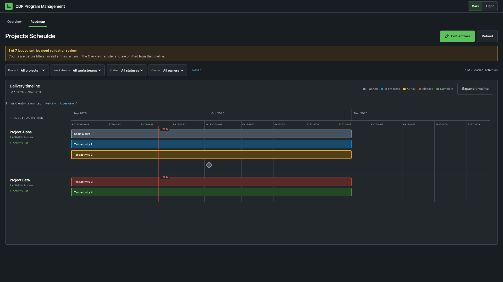

# CDP Program Management

CDP Program Management is a lookup-backed planning canvas for Splunk Enterprise. It combines a React timeline with an Overview register, shared filters, validation feedback, accessible details, fiscal-week subdivisions, and a native Dashboard Studio fallback. The stable Splunk app ID is `cdp_roadmap`.



Additional views: [light theme](docs/screenshots/roadmap-light.png) · [mobile viewport](docs/screenshots/roadmap-mobile.png)

## Features

- Project and activity grouping with shared project, workstream, status, and owner filters.
- Read-only timeline and entry details backed by one bounded `inputlookup max=1001` search.
- Planned, In progress, At risk, Blocked, and Complete states with text and color.
- Milestone points for same-day activities and informational dependencies.
- Federal fiscal-week labels: the fiscal year starts October 1; W01 begins October 1, seven-day intervals follow, and a final partial W53 ends September 30.
- A two-pixel **Today** marker derived from the browser's local calendar date. It appears only when today falls inside the visible timeline.
- Dark and light canvas themes. Only the theme choice is stored in browser local storage; lookup records are not cached there.
- Accessible keyboard navigation, focus-managed details, responsive controls, and horizontally scrollable narrow timelines.
- A Dashboard Studio fallback at `studio_roadmap`.

The included `lookups/cdp_roadmap.csv` contains exactly eight reviewed, illustrative seed rows. They are examples, not a real delivery plan or commitment.

## Compatibility assumptions

The app targets Splunk Enterprise 10.x and has been exercised on Splunk Enterprise 10.4.1. It uses Classic Simple XML 1.1, SplunkJS MVC, Dashboard Studio schema version 2, and the Splunk Lookup Editor app for editing. JavaScript must be enabled. The production bundle targets Chrome 100+, Firefox 100+, and Safari 15.4+.

Splunk Cloud compatibility or certification is not claimed. Run Splunk AppInspect and your own acceptance checks for the target platform before production use.

## Install

1. Download `cdp_roadmap-0.4.1.tgz` from the v0.4.1 release.
2. Back up any existing `cdp_roadmap` app, especially `local/`, `lookups/`, and `metadata/`.
3. Install through your supported Splunk app-management process.
4. Confirm the effective app ID and version, then open:

   `/en-US/app/cdp_roadmap/roadmap`

5. Verify the lookup ACL, the eight seed rows (new installs only), timeline rendering, filters, details, and the Edit entries link.

A service restart is not always required, but app/view discovery must be refreshed according to your Splunk operating procedure.

## Upgrade

Treat upgrades as controlled app replacements. Preserve site-owned `local/`, `lookups/`, and metadata ACL content; the packaged seed lookup must not overwrite live planning data. Stage and inspect the archive, compare effective configuration before and after, activate app discovery, and repeat the route/search/UI checks. No environment-specific deployment automation is published in this repository.

## Edit roadmap data

Choose **Edit entries** to open Lookup Editor for `cdp_roadmap/cdp_roadmap.csv`. Save there, return to the app, and choose **Reload**. The canvas never writes the lookup itself. See [Lookup schema](docs/lookup-schema.md) for columns and validation rules.

## Build and test

Requirements: Python 3.9+, Node.js 20+, and npm.

```sh
npm ci --ignore-scripts
npm test
npm run build
sha256sum build/cdp_roadmap-0.4.1.tgz
```

`tools/build_release.py` creates a deterministic archive with `cdp_roadmap/` at the root and records file hashes in `build/manifest.json`. Only `default/`, `metadata/`, `lookups/`, and `appserver/` are packaged.

## Rollback and uninstall

Rollback by restoring a verified pre-upgrade backup of the complete app directory, while preserving lookup or ACL changes made after the upgrade when required. Refresh app discovery and repeat the same verification checks. Uninstall only through an approved Splunk maintenance process after exporting any roadmap data that must be retained. Removing the app removes its packaged views and may remove locally maintained lookup data.

## Known constraints

- Maximum 1,000 rendered rows; row 1,001 is used only to detect overflow.
- Dependencies are displayed as metadata, not scheduled automatically.
- End dates are exclusive for bars; same-day entries render as milestone points.
- Invalid rows remain inspectable in Overview but are omitted from the timeline.
- Lookup ACLs are admin-only by default and must be deliberately changed for broader access.
- The Studio fallback is activity-oriented and does not reproduce all React project-grouping behavior.
- The visible heading intentionally retains the historical spelling `Projects Scheulde` in v0.4.1.

## Documentation

- [Architecture and data flow](docs/architecture.md)
- [Lookup schema](docs/lookup-schema.md)
- [Administrator guide](docs/administrator-guide.md)
- [Release process](docs/release-process.md)
- [Security and privacy](docs/security-privacy.md)
- [Contributing](CONTRIBUTING.md)
- [Security policy](SECURITY.md)
- [Changelog](CHANGELOG.md)

## License status

No license is granted at this time. The repository is publicly visible for inspection and collaboration, but copyright and other rights remain reserved until the owner selects and adds a license. See `CONTRIBUTING.md` before submitting changes.
